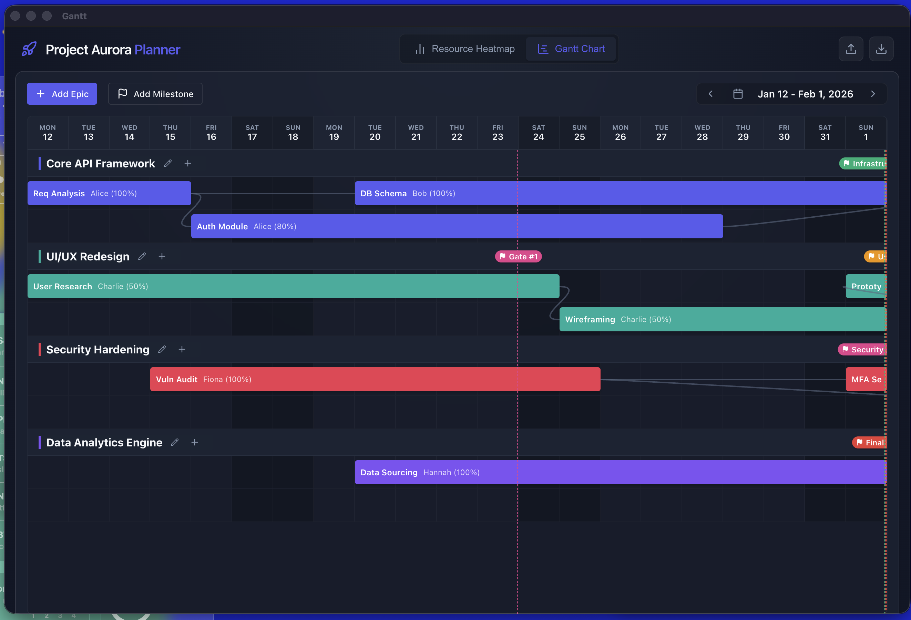
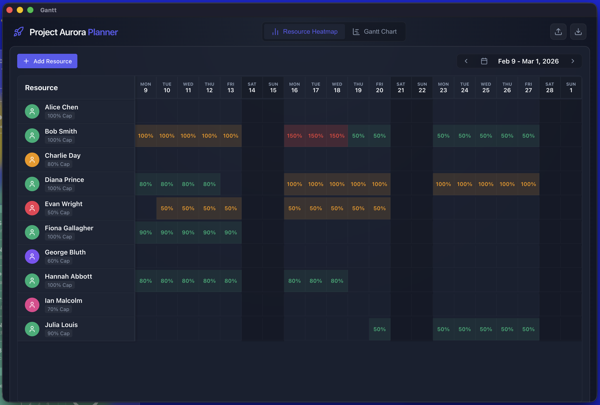
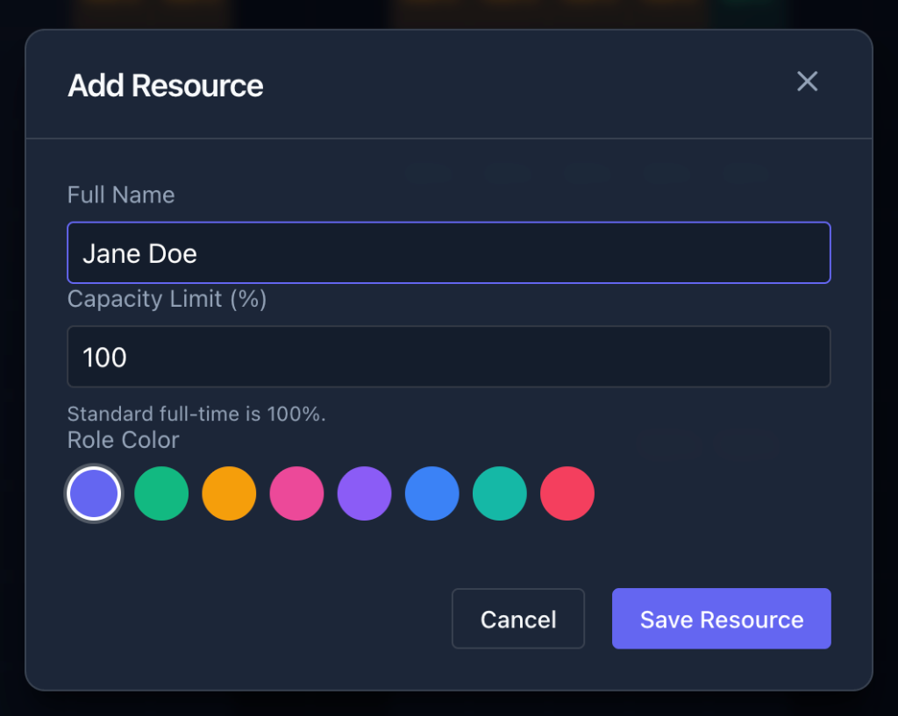
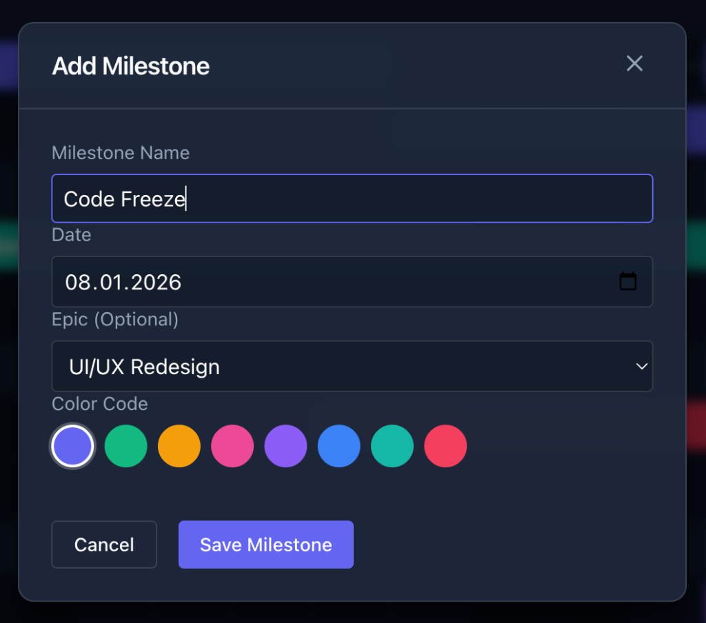
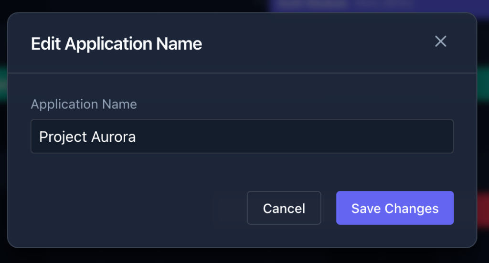
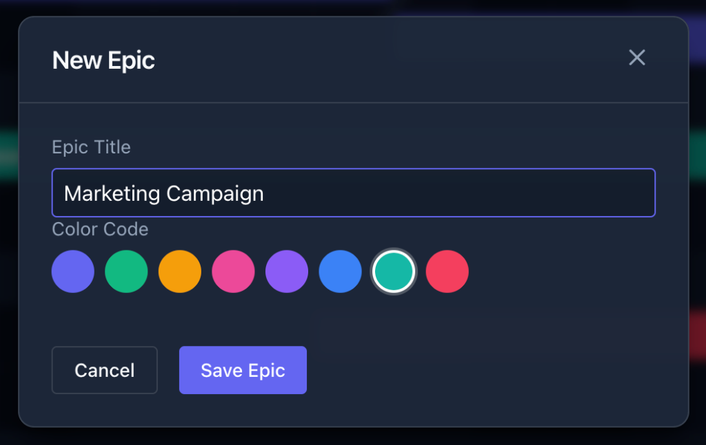
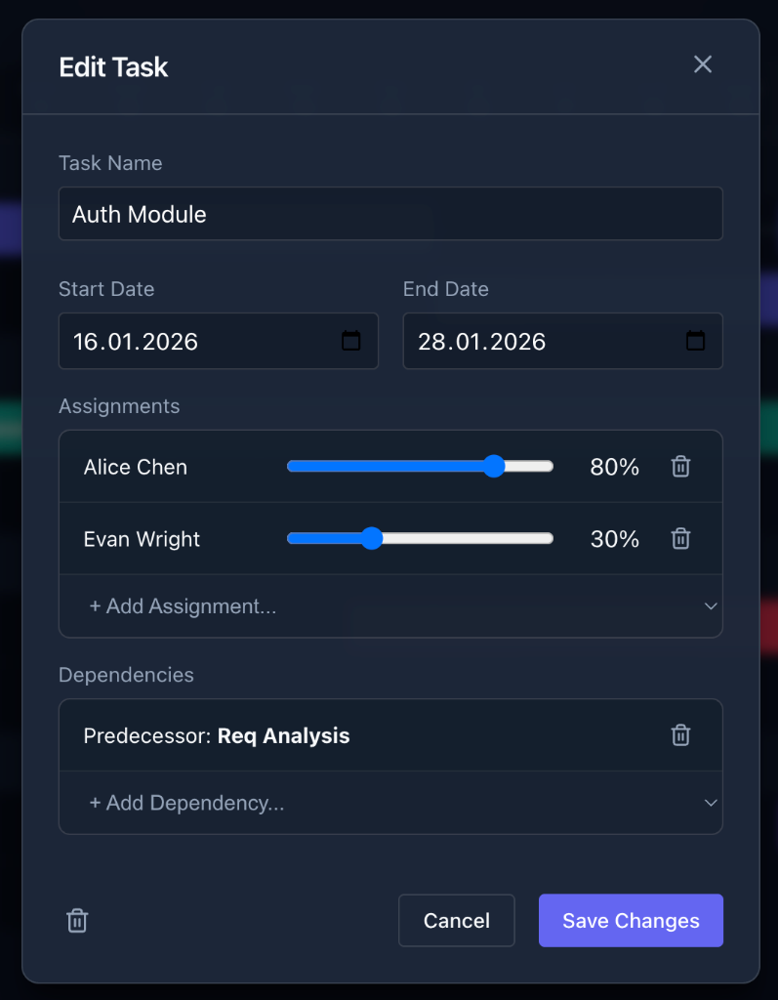

# Vibe Planner

Vibe Planner is a modern, interactive resource capacity planning and Gantt chart application built with **Gemini 3 Pro**, **Vue 3**, **TypeScript**, and **Electron**. It provides teams with a seamless way to visualize workload distribution, manage project timelines, and ensure optimal resource allocation.

Try it here <https://filipmagula.github.io/gantt/> and import a demo project to get started.
Download a JSON based demo project from here: <https://filipmagula.github.io/gantt/docs/projects/capacity-plan-2026-01-08_19-27-15.json>.

## Key Features

### 🚀 Client-side application only

- Your project can be **exported** as a JSON file and **imported** back later. If you forget to save your project it will be stored for you in **local storage** of your browser.

### 🖥️ Native Desktop Experience

- **Electron Integration**: Run as a native desktop application for macOS, Windows, or Linux.
- **Offline First**: All data is persisted locally, ensuring you never lose your planning state.

### 📅 Advanced Gantt Chart

- **Colorful Timeline**: Yes, it is colorful to bring more joy into the world of Project Management.
- **Compressed View**: Intelligent waterfall layout automatically packs non-overlapping tasks into shared rows, optimizing vertical space.
- **Dependency Visualization**: Clear curved bezier lines connect dependent tasks.
- **Milestones**: Track key project dates with global and epic-specific milestones.

### 👥 Resource Management

- **Capacity Heatmap**: Visualize team workload intensity (Green/Yellow/Red) to spot bottlenecks instantly.
- **Role Awareness**: Color-coded resource roles (Management, Dev, QA, etc.).

## Application Preview

### Main Views

| Gantt Chart |
|:---:|
|  |

| Resource Heatmap |
|:---:|
|  |

### Management Modals

| Add or Edit Resource | Add or Edit Milestone |
|:---:|:---:|
|  |  |

| Edit Application Name | Add or Edit Epic |
|:---:|:---:|
| |  |

|  Add or Edit Task |  |
|:---:|:---:|
|  |  |

## Getting Started

### Prerequisites

- Node.js (LTS recommended)
- npm

### Installation

```bash
npm install
```

### Development

Start the local development server (Web Mode):

```bash
npm run dev
```

Start the Electron desktop app (Dev Mode):

```bash
npm run electron:dev
```

### Building for Production

Build the web application:

```bash
npm run build
```

Build the Desktop Application (Electron):

```bash
npm run dist
```

The desktop artifacts (DMG, AppImage, Exe) will be output to the `release/` directory.

## Technology Stack

- **AI**: Gemini 3 Pro & Antigravity
- **Framework**: Vue 3 + TypeScript
- **Build Tool**: Vite
- **Desktop Runtime**: Electron
- **State Management**: Pinia
- **Icons**: Lucide Vue Next
- **Date Handling**: date-fns
